# Quản Lý Trọ

Ứng dụng Flutter hỗ trợ quản lý bài đăng cho thuê, lịch hẹn xem phòng và các tác vụ dành cho chủ trọ và admin, kết hợp cùng ứng dụng Trọ tốt, tại "https://github.com/Nguyenlong270501/trotot"

<div align="center">


</div>

## Giới thiệu

**Quản Lý Trọ** là một ứng dụng di động được xây dựng bằng Flutter để hỗ trợ quản lý bài đăng nhà trọ theo nhiều vai trò khác nhau. Ứng dụng tập trung vào trải nghiệm cho:

- **Chủ trọ**: tạo, chỉnh sửa và quản lý bài đăng/phòng trọ.
- **Admin**: duyệt đơn đăng ký, duyệt bài đăng và quản lý người dùng.

Dự án đang sử dụng các dịch vụ như **Firebase**, **Google Sign-In/Facebook Login**, **Cloud Firestore**, **Firebase Cloud Messaging**, **Geolocator**, **Goong Maps/MapLibre** và **Hive** để lưu trữ cục bộ.

## Tính năng nổi bật

### Dành cho chủ trọ
- Tạo và quản lý bài đăng phòng trọ.
- Cập nhật thông tin phòng, giá thuê và trạng thái phòng.
- Quản lý chi tiết bài đăng và thông tin liên quan.
- Theo dõi lịch hẹn xem phòng.

### Dành cho admin
- Duyệt yêu cầu đăng ký chủ trọ.
- Duyệt bài đăng phòng trọ.
- Quản lý người dùng trong hệ thống.
- Xem các dữ liệu tổng quan trên dashboard.


## Màn hình giao diện

### Một số ảnh chụp màn hình

<table>
  <tr>
    <td>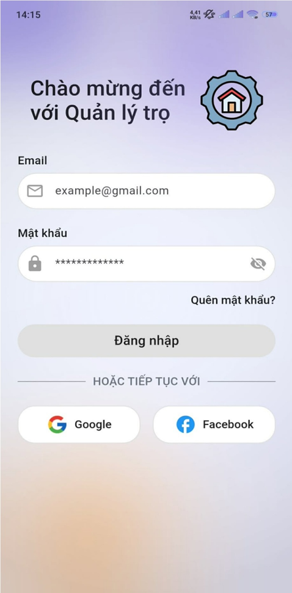</td>
    <td>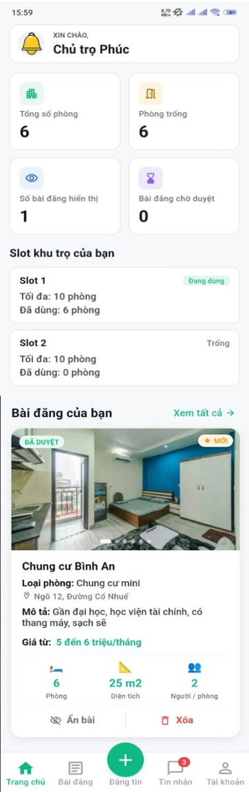</td>
    <td>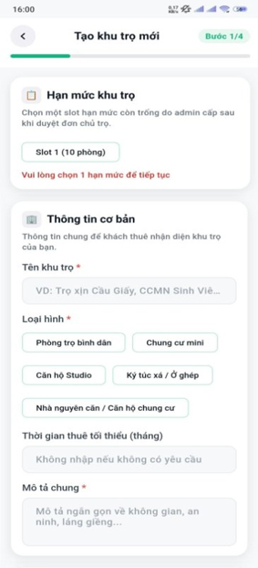</td>
  </tr>
  <tr>
    <td>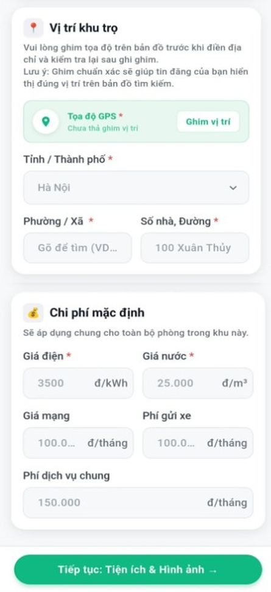</td>
    <td>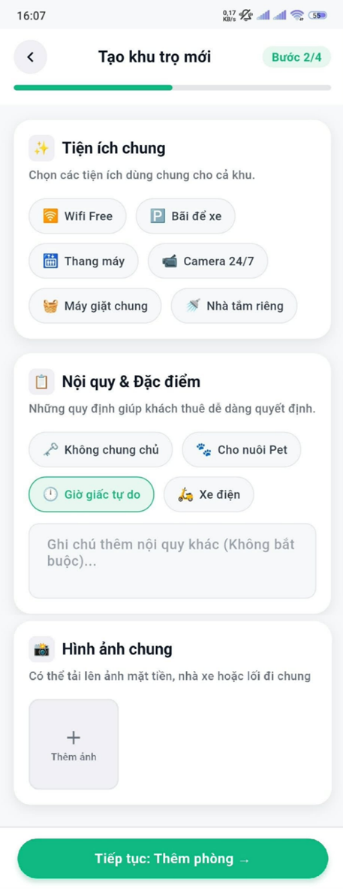</td>
    <td>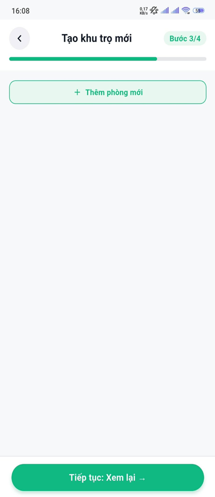</td>
  </tr>
  <tr>
    <td>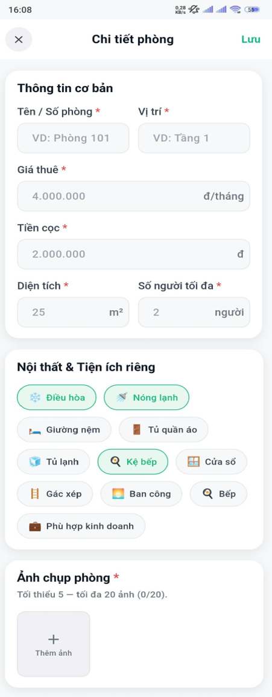</td>
    <td>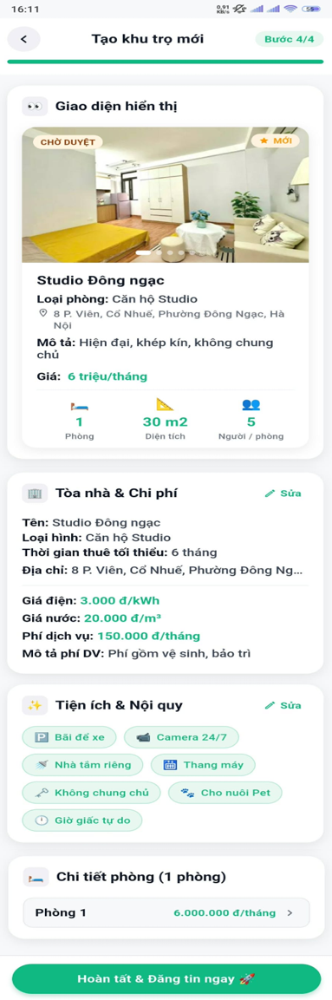</td>
    <td>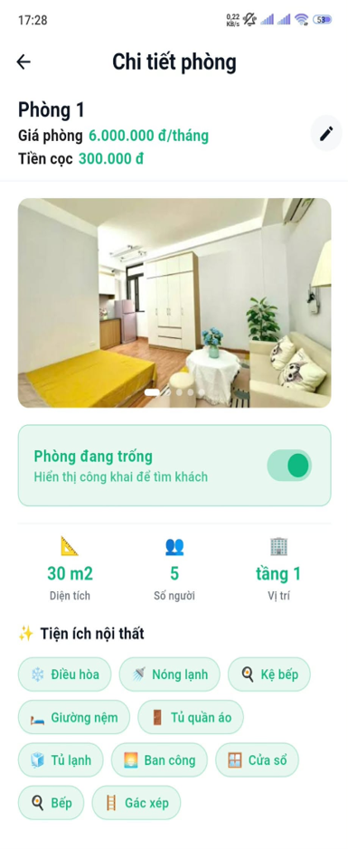</td>
  </tr>
  <tr>
    <td>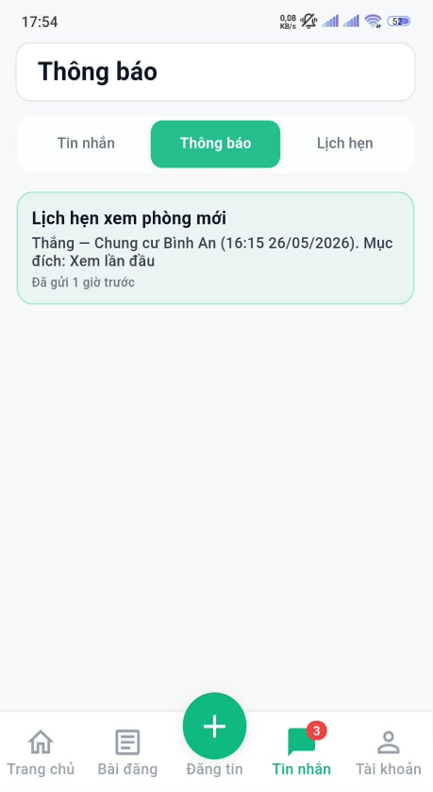</td>
    <td>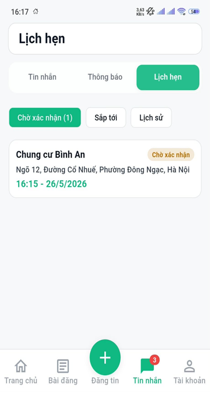</td>
    <td>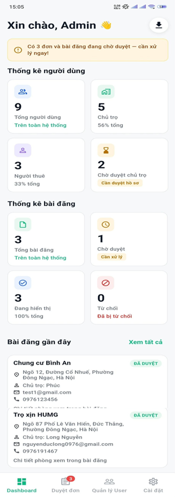</td>
  </tr>
  <tr>
    <td></td>
    <td></td>
    <td></td>
  </tr>
</table>

## Công nghệ sử dụng

- Flutter 3.x
- Dart 3.x
- Firebase Auth
- Cloud Firestore
- Firebase Cloud Messaging
- Firebase Storage
- Cloud Functions
- Google Sign-In
- Facebook Auth
- Google Maps / MapLibre
- Geolocator
- Hive
- BLoC / Cubit
- Go Router
- Dio

## Cấu trúc dự án

Dự án được tổ chức theo hướng feature-based:

- `features/auth`: xác thực người dùng.
- `features/admin`: dashboard, duyệt bài, quản lý người dùng.
- `features/landlord`: quản lý phòng trọ, lịch hẹn, tin nhắn.
- `features/profile`: hồ sơ cá nhân, đổi mật khẩu.
- `features/splash`: màn hình khởi động.
- `core`: routing, constants, services và tiện ích dùng chung.

## Cài đặt và chạy dự án

### Yêu cầu môi trường
- Flutter SDK 3.11+ (theo `pubspec.yaml`)
- Dart 3.11+
- Android Studio / VS Code / IntelliJ IDEA
- Tài khoản Firebase
- API key Goong Map

### Bước cài đặt

1. Clone repository:

```bash
git clone https://github.com/Nguyenlong270501/quanlytro.git
cd quanlytro
```

2. Cài đặt dependencies:

```bash
flutter pub get
```

3. Cấu hình Firebase cho dự án Flutter:
- Thêm `firebase_options.dart` hợp lệ.
- Cấu hình các nền tảng Android/iOS tương ứng.

4. Kiểm tra tài nguyên assets:
- `assets/images/`
- `assets/icons/`
- `assets/data_vietnam.json`

5. Chạy ứng dụng:

```bash
flutter run
```

## Cấu hình bổ sung

Dự án đang dùng các dịch vụ sau và có thể cần cấu hình riêng:

- **Firebase Authentication**
- **Cloud Firestore**
- **Firebase Messaging**
- **Firebase Storage**
- **Cloud Functions**
- **Location permissions**
- **Goong Map services**

## Ghi chú

- Ứng dụng được cấu hình chạy theo chiều dọc.
- Splash screen và icon ứng dụng đã được thiết lập bằng `flutter_native_splash` và `flutter_launcher_icons`.
- Giao diện điều hướng được quản lý bằng `go_router`.

## Tác giả

Dự án: [Nguyenlong270501/quanlytro](https://github.com/Nguyenlong270501/quanlytro)